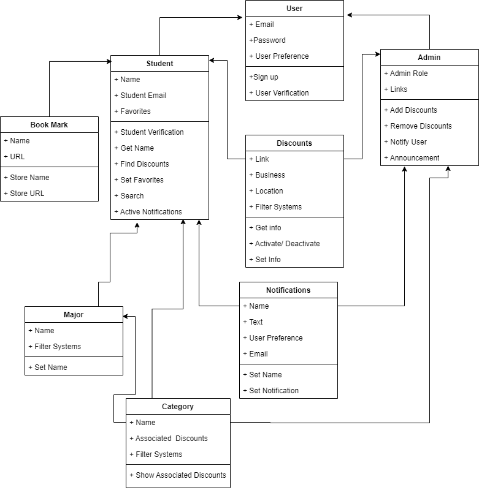

# Team Project - D.2 Requirements

**Team:** 8 - StudentDiscountz

## System Description

Navigating scattered and unreliable **student** **discounts** is a time-consuming hassle. StudentDiscountz is a web-based aggregator that centralizes **Student**-centric **discounts**, making it the go-to platform for budget-conscious scholars. Unlike Unidays, we offer a simple, clean interface with **major**-specific ***filters***, serving as an essential money-saving tool for **students**.

**Users** can register through a simple ***sign-up*** process that asks for an *email address* and a *password*. It then ***verifies*** whether the user is a **Student** or **Admin**. Once inside, they're greeted by an easily navigable dashboard that centralizes the latest **discounts** with the name of the *business*, its *location*, and a *link* to their website if applicable.

**Students** can utilize a robust ***search function*** to scour for deals based on **category** or their **major**. They can ***activate*** **notifications** to alert them of new **discounts** in **categories** of interest or **bookmark** favorites for later perusal. As for the **notifications**, it will be generated automatically based on the *user preferences* and as mentioned before, sent via *email* to keep **students** informed. For those who want more fine-grained control, ***filters*** allow **Students** to sort **discounts** based on *location*, **category**, **major**, and more. Additionally, if **students** want to be more creative with their **bookmarks** they can use the *name* and *URL* of the business, which will store the *store name* and *store URL* in their user profile for future reference. 

Behind the scenes, **Admins** have the power to ***add*** or ***remove*** **discounts**, ensuring only the most relevant and functional offers are available. They also provide **discounts**, complete with *links* to websites, that get shown to **Students**. **admins** can also **send notifications** or make *announcements* to **Students**, keeping them in the loop about the latest deals or updates.

## Part 2: UML diagram

