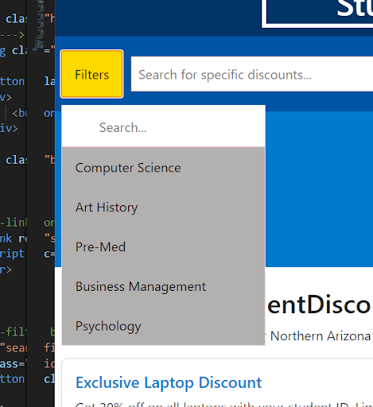
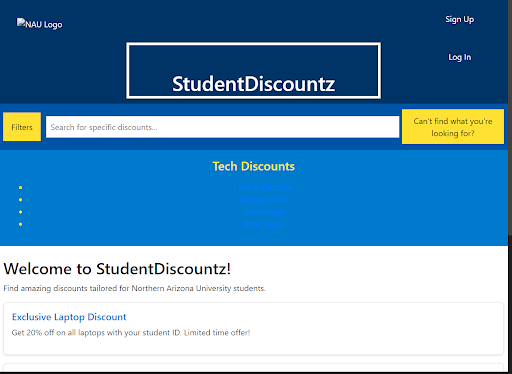
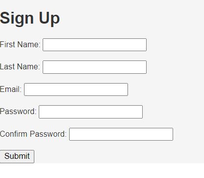
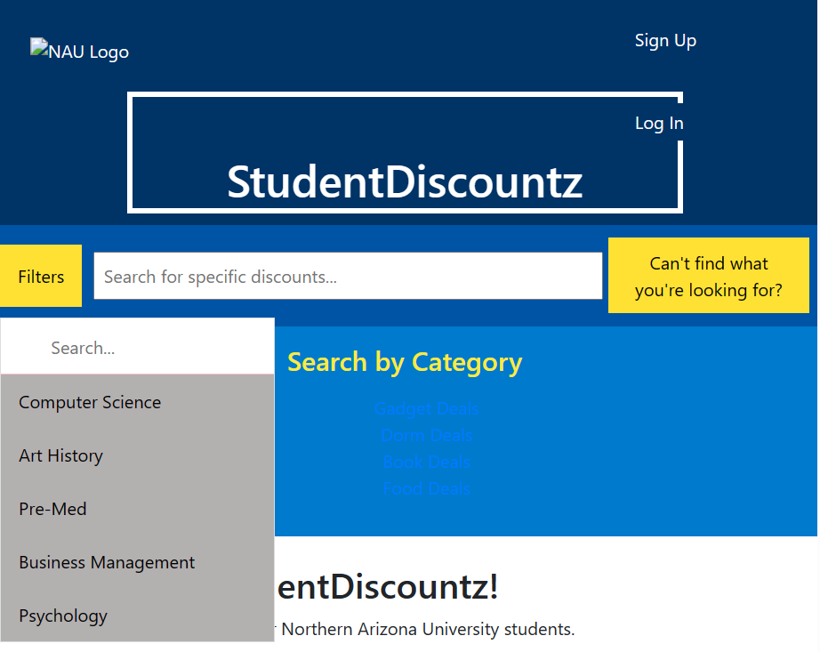
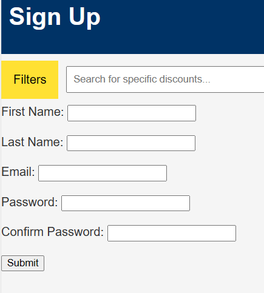
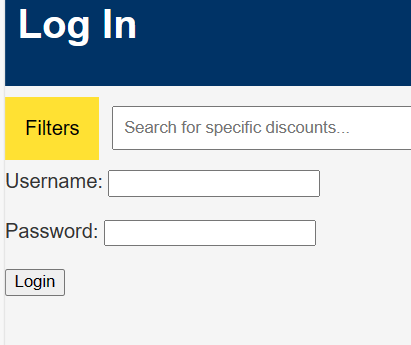

# Team Project - D.4 Implementation

**Team:** 8 - StudentDiscountz

## Introduction (Ceanna & Jennie)

StudentDiscountz is a website designed for college students looking for a discount. This makes it easier for students to save money by centralizing student-specific discounts, especially from small local businesses. One of the key features of this website is the search bar. The search bar can be used so that students can search for a particular brand or deal they are looking for. Additionally, if they use the filter button they can look for a particular major that would use that type of material. Another feature of this website is to allow students to create an account so they can have a login account to narrow down what type of discounts they like. On the home page itself, students can find any discount, and even some by category. The category feature will redirect students to another page where they can find more discounts on a more materialist level like dorm room decorations or even book deals. Overall, this system is an easier way for students to find discounts on supplies they use every day.

 [Text Link] (https://github.com/aaronr7734/team-8-project)
## Implemented Requirements (Jessica & Elizabeth)

**Requirement:** As a student, I want to be able to be informated about any flash saled going on for specific dates\
**Issue:** [Issue](https://github.com/aaronr7734/team-8-project/issues/34)\
**Pull Reques:**: [Pull Request](https://github.com/aaronr7734/team-8-project/pull/65)\
**Implemented:** Jennie\
**Approved:*** Elizabeth Knight

**Requirement:** As a user, I want to be able navigate a website easier and find deals in an efficient manner\
**Issue:** [Issue](https://github.com/aaronr7734/team-8-project/issues/36)\
**Pull Request:** [Pull Request](https://github.com/aaronr7734/team-8-project/pull/48)\
**Implemented:** Elizabeth Knight\
**Approved:** Ceanna Jarrett\
**Print Screen:**\

**Requirement:** As a student, I want to be able to easily access discounts from a dashboard view.\
**Issue:** [Issue](https://github.com/aaronr7734/team-8-project/issues/33)\
**Pull Request:** [Pull Request](https://github.com/aaronr7734/team-8-project/pull/21)\
**Implemented:** Jessica Maldonado\
**Approved:** Ceanna Jarrett\
**Print Screen**\

**Requirement:**  As a contributor to many projects, I want to be able to see what the Student Discountz project is about so that I can provide relevant input.\
**Issue:** [Issue](https://github.com/aaronr7734/team-8-project/issues/35)\
**Pull Request:** [Pull Request](https://github.com/aaronr7734/team-8-project/pull/52)\
**Implemented:** Elizabeth Knight\
**Approved:** Ceanna Jarrett\

**Requirement:** As a frequent user of the website, I want to be able to sign up for an account so I can continue my student discounts journey anytime.\
**Issue:** [Issue](https://github.com/aaronr7734/team-8-project/issues/53)\
**Pull Request:** [Pull Request](https://github.com/aaronr7734/team-8-project/pull/57)\
**Implemented:** Ceanna Jarrett\
**Approved:** Aaron Ramierez\
**Print Screen**\

**Requirement:** As college student looking for discounts, I want to be able to be redirected to the discount itself when I choose one so that I don’t have to look for it myself.\
**Issue:**[Issue](https://github.com/aaronr7734/team-8-project/issues/33)\
**Pull Request:**[Pull Request](https://github.com/aaronr7734/team-8-project/pull/21)\
**Implemented:** Jessica Maldonado\
**Approved:** Jessica Maldonado

## Tests (Aaron)

## Adopted Technologies (Ceanna & Chase)
Github - We use GitHub to store code, deliverables, and reports concerning the website. GitHub allows us to build our project from the ground up by giving us the ability to individually add to the website in one centralized area.

Discord - This is our main form of communication outside of GitHub. We use this to plan meetings, ask questions, assign deadlines, and overall discuss any topic that is beneficial to our website.

Excel: We use an Excel spreadsheet to assign work and reference what we have done throughout the week. This allows us to form a more effective agenda and keep track of who did what.

Django - This will be the backend framework that we will use. Django is a good framework for backend website development due to its ease-of-use, available tools, versatility, and development capabilities.

Bootstrap- This will be the frontend framework that we will use. Bootstrap is a good framework for the frontend due to its HTML and CSS support as well as its responsive design, browser compatibility, and its accessibility.

JavaScript: We will use JavaScript to help with the API. Javascript fits best given HTML and the API that is required to accomplish this task. We found that Javascript offers simple API integration while allowing for custom functionality.

## Learning/Training (Jennie)

## Deployment (Aaron)

## Licensing (Chase)
We decided to use the MIT License for our project, Student Discountz. We favored the MIT License because it maintains a good balance between openness and simplicity. It offers developers and organizations the freedom to use and contribute to projects while minimizing legal and compliance concerns. We believe this to be important considering this is a class project and therefore we do not need anything fancy or overbearing.

## Readme File (Elizabeth)

[README](https://github.com/aaronr7734/team-8-project/blob/main/README.md)

[CONTRIBUTING](https://github.com/aaronr7734/team-8-project/blob/main/CONTRIBUTING.md)

[CODE OF CONDUCT](https://github.com/aaronr7734/team-8-project/blob/main/CODE_OF_CONDUCT.md)

## Look & Feel (Chase)
For our UI, we decided to try to give our users a flexible yet thorough interface that will allow them to find various discounts through various means. A few of our functional utilities include a drop down filter by major, a search bar, and a search by category section. We believe this will give users adequate discount searching capabilities. We also included login and sign up pages that will allow users to access more selective features in the future. While our current features are functional, they are not currently looking the way we want them to and thus will be updated further at a later date.

## Lessons Learned (Jennie)

## Demo (Ceanna & Jessica)
