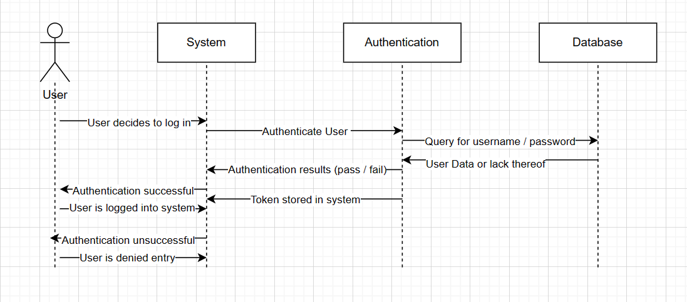
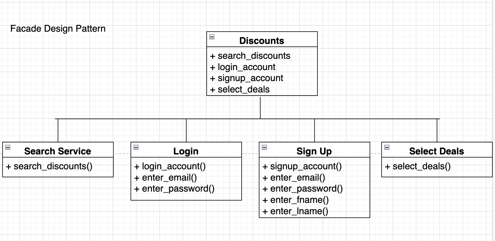

# Team Project - D.5 Design

**Team:** 8 - StudentDiscountz

## Description

StudentDiscountz is a web-based aggregator that centralizes Student-centric discounts, making it the go-to platform for budget-conscious scholars. Students sign up with their name (first and last,) an email address from an educational institution and a password, and they're then granted access to a dashboard that allows them to view, filter, and bookmark discounts from various categories.

At the heart of StudentDiscountz, Django forms the backbone of our server-side logic, managing data models, handling requests, and processing responses. We leverage Django's robust features to serve a RESTful API, which provides a seamless interface for data interaction. This API is the channel through which student information, discount details, and user preferences are efficiently transmitted. On the front end, we utilize JavaScript, enriched with the Bootstrap framework, to create a dynamic and responsive user interface. This combination will eventually allow us to offer an intuitive and engaging experience for students.
## Architecture
### Monolithic Architecture Diagram 
  
We chose a Monolithic Architecture for its modular design; we figured this best fit our product. We decided to choose this architecture for its organized yet simplistic approach which allows us to better navigate, update, and debug our application. Each module has a clear responsibility, which simplifies unit testing and can lead to more robust software. The separation of the UI and API also allows for the possibility of different front-end implementations (web, mobile, desktop) to interact with the backend services consistently. We believe that the Monolithic architecture best reflects our design and thus was the best choice.

## Class Diagram

## Sequence Diagram
### Sequence Diagram

For the sequence diagram, there are two actors, the user, and system, which are used to demonstrate the use case of the user trying to log in to the website and the system verifies if the user has an existing account or not. This use case is based on pre-conditions like the website is accessible, the student has internet access, and the user has the appropriate login credentials. The diagram starts with the user initiating the login by putting in their email and password. Next, the system verifies the credentials by searching through the database for an existing account. Then, if the user's account exists, the system authenticates the user, logs in the user, stores a token within the system, and the system directs the user to their personalized dashboard. If the user's account was nonexistent, the system would notify the user that their login attempt failed and prompt the user to check their credentials again. Therefore the post-conditions include the user's successful login attempt and if the login attempt failed it would display an error message. 

## Design Patterns
### Design Pattern #1 - The Facade Design Pattern (Structural)
 
**Search Service**   
https://github.com/aaronr7734/team-8-project/blob/main/code/server/discountz_app/views.py 

**Login**  
https://github.com/aaronr7734/team-8-project/blob/main/code/server/discountz_app/views.py 

**Sign Up**   
https://github.com/aaronr7734/team-8-project/blob/main/code/server/discountz_app/views.py 

**Select Deals**  
https://github.com/aaronr7734/team-8-project/blob/main/code/server/discountz_app/views.py 

###  Design Pattern #2 - The Observer Design Pattern (Behavioral)
 
**Discounts**  
https://github.com/aaronr7734/team-8-project/blob/main/code/server/discountz_app/models.py

**Discounts**  
https://github.com/aaronr7734/team-8-project/blob/main/code/server/discountz_app/models.py

**Category**   
https://github.com/aaronr7734/team-8-project/blob/main/code//server/discountz_app/models.py

## Design Principles

In our Django (back-end) project, the design primarily adheres to the Single Responsibility and Open/Closed SOLID principles. The Single Responsibility Principle is exemplified in the `Student` model, which is tasked solely with managing student data, avoiding the overlap of responsibilities. The `StudentManager` class showcases the Open/Closed Principle, as it extends Django's default UserManager, allowing for new user creation methods without needing to modify the existing code base. This approach facilitates adaptability and future enhancements while maintaining the integrity of the original UserManager class. None of the other principles were demonstrated on the back end as far as we can tell.

For our front-end side, we use different SOLID principles throughout our interaction with the HTML and CSS aspects of the website. A primary example of this would be the Single Responsibility Principle where we directly made certain parts of our CSS file towards something in the HTML. For example, when it came to the login/sign-up buttons and links to other pages we used this principle by creating individual classes for them where one was labeled `login` and the other was labeled `sign-up` in the CSS file then used as a class in the HTML. Another principle we used was the Open/Closed Principle, where we created a class in CSS called `discount-card`. The `discount-card` has an open concept since it is the framework for how we build the text and the box itself and then has a closed concept when we are directly using it for something. An example would be our laptop discount section on the website since we did an ID for it to directly be about the laptop discount making itself closed. Lastly, we found the Interface Segregation Principle being used since everything inside of our HTML and CSS is being used to perform the appearance we need for the overall website. 
