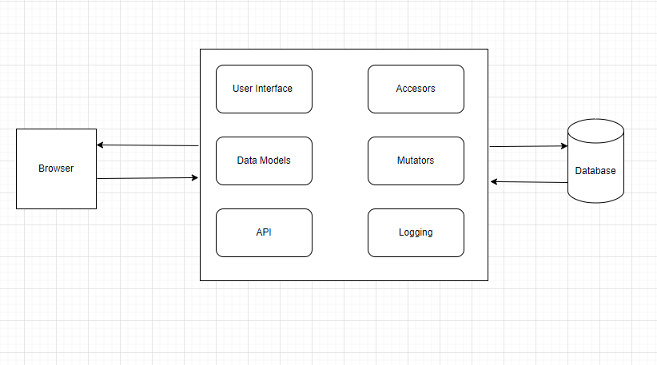
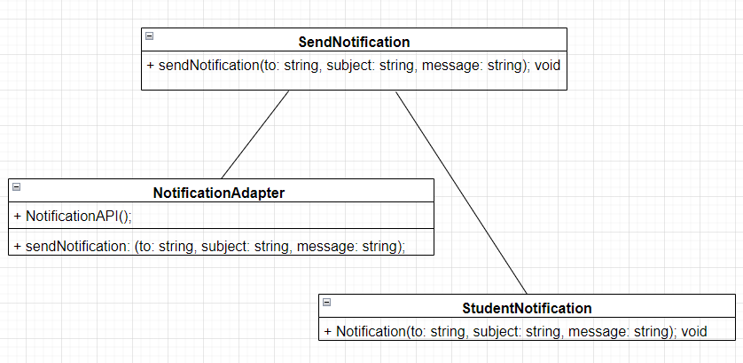
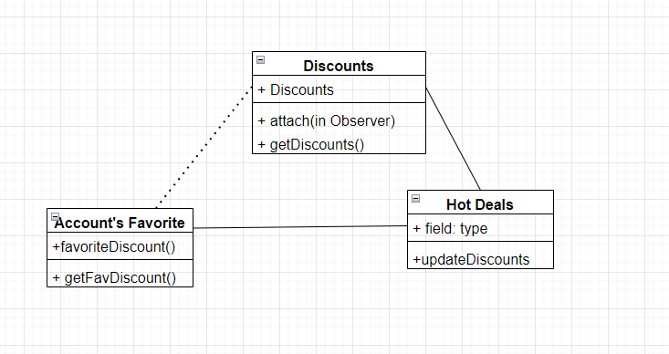

# Team Project - D.5 Design

**Team:** 8 - StudentDiscountz

## Description

## Architecture
Monolithic Architecture 

We chose a Monolithic Architecture for its modular design; we figured this best fit our product. We decided to choose this architecture for its organized yet simplistic approach which allows us to better navigate, update, and debug our application. Each module has a clear responsibility, which simplifies unit testing and can lead to more robust software. The separation of the UI and API also allows for the possibility of different front-end implementations (web, mobile, desktop) to interact with the backend services in a consistent manner. We believe that the Monolithic architecture best reflects our design and thus was the best choice.

## Class Diagram

## Sequence Diagram

## Design Patterns
Adapter Design Pattern 
 
Observe Design Pattern 
 

## Design Principles

