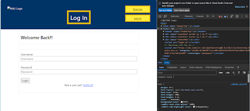

# Team Project - D.6 Implementation 2

**Team:** 8 - StudentDiscountz

## Introduction
StudentDiscountz is a website for students trying to save some money with designated scholarly discounts. The website's key feature centralizes student-specific discounts which enables users to be able to locate items they need for a cheaper price. The search bar feature which can be found on the home page allows users to look for specific discounts in their areas of interest. If a student would like more specific discounts, then the filter feature lets users be able to search for items in a particular category. Rather than losing their progress if a user wishes to log off, the website features an account system that allows users to narrow down what type of discounts they like. The home page allows users to have a more general sense of discounts offered and even split some discounts by category. This allows deals like technology and dorm supplies to be separated for ease of use for the user. Overall, StudentDiscountz simplifies the student shopping experience with centralized discounts, a user-friendly search and filter system, and a convenient login feature for personalized preferences.

## Requirements

#53
**Requirement:** As an administrator for the StudentDiscountz, I want to create a sign-up page that has full functionality so that users can sign up.\
**Issue:** [Issue](https://github.com/aaronr7734/team-8-project/issues/53)\
**Pull Request:** [Pull Request](https://github.com/aaronr7734/team-8-project/pull/57)\
**Implemented by:** Ceanna Jarrett\
**Approved By:** Aaron Ramirez\
**Print Screen:**

#213
**Requirement:**  As a student, I would like to have a simple way of finding account options and major selections.\
**Issue:** [Issue](https://github.com/aaronr7734/team-8-project/issues/213#issue-2000689727)\
**Pull Request:** [Pull Request](https://github.com/aaronr7734/team-8-project/pull/211#issue2000685566)\
**Implemented:** Elizabeth Knight\
**Approved By:** Jennie Butch\
**Print Screen:**

#189
**Requirement:** As a frequent user of the website, I want an easy way to access my account again when I return to the website to see my favorite deals.\
**Issue:** [Issue](https://github.com/aaronr7734/team-8-project/issues/186#issue-1998166131)\
**Pull Request:** [Pull Request](https://github.com/aaronr7734/team-8-project/pull/188)\
**Implemented:** Ceanna Jarrett\
**Approved By:** Jessica Maldonado\
**Print Screen:** N/A

#212
**Requirement:** As a developer of Student Discountz, I redesigned the homepage so it looked more professional.\
**Issue:** [Issue](https://github.com/aaronr7734/team-8-project/issues/212)\
**Pull Request:** [Pull Request](https://github.com/aaronr7734/team-8-project/pull/211)\
**Implemented by:** Elizabeth Knight\
**Approved by:** Jennie Butch\
**Print Screen:**

\

#203
**Requirement:** As a developer, I want to implement automated tests so I can be sure that the code is working.\
**Issue:** [Issue](https://github.com/aaronr7734/team-8-project/issues/214)\
**Pull Request:** [Pull Request](https://github.com/aaronr7734/team-8-project/pull/195)\
**Implemented by:** Aaron Ramirez\
**Approved by:** Jessica Maldonado\
**Print Screen:** N/A

#141
**Requirement:** As a developer, I want to utilize Bootstrap to make our frontend code more efficient.\
**Issue:** [Issue](https://github.com/aaronr7734/team-8-project/issues/141)\
**Pull request:** [Pull Request](https://github.com/aaronr7734/team-8-project/pull/188)\
**Implemented by:** Ceanna Jarrett\
**Approved by:** Jessica Maldonado\
**Printed Screen:** N/A

## Tests

For our automated tests, we primarily used Django's built-in testing Framework, which is based on Python's built-in unit test module. It was difficult for us, and we didn't have complete code coverage because we didn't have enough time to familiarize ourselves with the DRF test framework to test our views.  We also spent massive chunks of time trying to fix bugs in our code which were issues with how we wrote the automated tests.

All of our automated tests can be found [Here.](https://github.com/aaronr7734/team-8-project/tree/main/code/server/discountz_app/automated_tests)
The class being tested can be found [here.](https://github.com/aaronr7734/team-8-project/blob/main/code/server/discountz_app/models.py#L41)
The test itself can be found [here.](https://github.com/aaronr7734/team-8-project/blob/main/code/server/discountz_app/automated_tests/test_model_student.py)

## Demo
[Video Link](https://youtu.be/dyd2h42NhM8)

## Code Quality

In managing code quality, our team primarily focused on the back-end, adhering closely to [Django's coding style](https://docs.djangoproject.com/en/dev/internals/contributing/writing-code/coding-style/). This guideline included the recommendation to format all files with [black](https://pypi.org/project/black/), which we diligently followed.

However, we encountered challenges regarding our docstrings. Black does not enforce specific line lengths for docstrings, whereas Django's style guide and PEP-8 do. Since Black would not automatically format these lines, and due to uncertainties in setting up pre-commit hooks, we opted for a more flexible approach, allowing longer comment lines.

Aside from style concerns, we emphasized modularity in our code. This approach was not only aimed at enhancing code quality but also a practical decision due to our team's limited experience with Git, specifically in handling merge conflicts.

Our policies and best practices were mostly uncodified, discussed, and agreed upon verbally rather than documented. This approach reflected the spoken decision-making process within our team.

For our frontend development, the collaboration within the team was centered around utilizing Bootstrap to enhance the efficiency of our HTML and CSS that already existed. To ensure code quality, our team followed a set of agreed set of practices and standards. We ended up establishing a coding style that defined the way we named things, indentation, and overall formatting. This helped maintain consistency across the board, making it more readable and understandable for the team members. In addition to style, we implemented version control using Git, allowing for collaboration and tracking changes. Constant review of our front-end code was a key method we used to make sure we were all on the same page. This method also helped us figure out anything features we wanted to add or any bugs we found along the way.

## Lessons Learned
With our website's second release, we've made a bunch of new changes. Starting with the homepage, we've got a more professional header now. Also, we added a "Hot Deal" section with all sorts of discounts.

For the login and sign-up pages, we changed them up because they didn't look professional enough. We learned that spending more time on these pages makes a better user experience. We added a link to the login page on the sign-up page, and vice versa, for those who are already users. We also put in a home button to make it easier to move around the website.

On the backend and the API, we figured out a lot more once we got into the code. We had a tough time with design patterns at first, but after working with the code, it started to make sense.

Communication has been tricky for us. Sometimes what we want to say gets lost or misunderstood. We're learning to adjust to these problems. When we plan what to code, we make sure everyone understands and has the opportunity to ask questions during our meetings. We're trying our best to keep everyone on the same page so no one falls behind.

We’ve been struggling with JavaScript, especially when it comes to pulling discounts from the API. JavaScript is new for most of us, and maybe it was a tough choice for this project.  If we continue this project after this class is over, we want to get better at JavaScript, make sure we're all talking the same language, and get the website to do what we originally outlined in previous deliverables.

